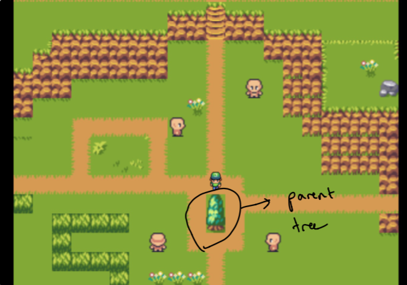
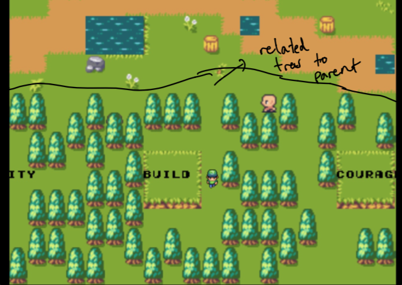

# Pluto
### A 2D digital garden/virtual world to explore connections across your data and go down spontaneous rabbit holes

## Demo
https://user-images.githubusercontent.com/7995105/130368243-63160f37-4d1e-4387-969f-b2ed8b7787b7.mov

## Contents
[Background](#background)  
[How do I navigate the garden?](#how-do-i-navigate-the-garden)
[Design](#design)
[Architecture](#architecture)  
[How do we find related pieces of data?](#how-do-we-find-related-pieces-of-data)
[Rendering](#rendering) 
[Where is the data?](#where-is-the-data)  
[Instructions](#instructions)  
[Future](#future)  
[Acknowledgements](#acknowledgements) 

## Background
The idea of a digital garden has always been super fascinating to me. Earlier this month, I started to wonder how could we present our digital garden as more than just text on a page? How could we make it interactive and create an experience around browsing your digital footprint? How could we make our digital garden feel like an **actual digital garden**. 

Flora is an experiment to explore this.

## How do I navigate the garden?
This is explained in detail in the tutorial at the [start](https://flora.amirbolous.com/) - please refer to that.

## Design
Settling on the design took several weeks of experiments. I wanted to be able to create a graph-like feel for viewing the data in my garden. The challenge was creating something that was intuitive but also technically feasible (within a little bit of time). This is why I settled on a "parent tree" isolated from the "forests" which are all of the most related pieces of data to the parent.

Note initially, the parent is just my home website and the forests are composed of data that are most similar to topics I care about. These are **not handpicked**. More on that later!

The full map is designed using the excellent [mapeditor](https://www.mapeditor.org/) tool completely from scratch using a [great tileset](https://opengameart.org/content/classic-rpg-tileset) I found from [Jestan](https://ko-fi.com/jestan). 

Both the tileset and map are **fully available** under the `map` folder so that you can fully play with it to make it your own.

Refer to the [rendering](#rendering) section for more details on how we render the map and add game logic.

## Architecture
Flora is written with [Poseidon](https://github.com/amirgamil/poseidon) and [Pixi](https://www.pixijs.com/) (for help with rendering) on the frontend, using a [Pixi tilemap plugin](https://github.com/pixijs/tilemap) (for fast tilemap rendering) and Go on the backend. It uses a custom semantic and full-text search algorithm to find connections between data in my digital footprint. This helps us find related content that is both topically and lexically similar to any specific data or a specific keyword (of which you might have noticed, I load a couple of important ones to me personally in the first screen, like startup, community, side projects etc). Refer below for how this algorithm works.

## How do we find related pieces of data?
I like to call this step generating a "graph on demand." Most of my data does not live in a tool that contains bidirectional links - most of my data is scattered across a range of links, notes, saved articles, and more. Trying to find any hyperlinks within the data (which I have saved as text) would be near impossible. Instead, I architected Flora so that we could do something else instead - we can use a custom semantic and full-text search algorithm to find the **most related pieces** of data. 

### Semantic search
The semantic part of the search algorithm consists of using [word embeddings](https://en.wikipedia.org/wiki/Word_embedding) which are high-dimensional vectors that encode various bits of information associated with words (e.g. a vector for the word king might have some information associated with male, ruler etc.). These are constructed in such a way where we can operate on these vectors (i.e. add them, subtract them average them) and maintain some kind of informational structure about the result.

This means for any piece of data, we can average all of the words to create a [document vector](https://towardsdatascience.com/document-embedding-techniques-fed3e7a6a25d?gi=34ef611d5d13) which is just a single vector that attempts to encode/summarize information about a data. There are more complex and meaningful ways of doing this than just averaging all of the word embeddings, but this was simple enough to implement and works relatively well for the purpose of this project.

Once we have a document vector for a piece of data, we can use the [cosine similarity](https://www.sciencedirect.com/topics/computer-science/cosine-similarity#:~:text=Cosine%20similarity%20measures%20the%20similarity,document%20similarity%20in%20text%20analysis.) to find how similar these two document vectors (and hence how similar the topics of any two pieces of data are). 

I use pre-trained word-embeddings from Facebook's [Creative Commons Licensed](https://creativecommons.org/licenses/by-sa/3.0/). Specifically I use 50k words from the data trained on Wikipedia 2017 UMBC webbase corpus found [here](https://fasttext.cc/docs/en/english-vectors.html). The actual dataset contains ~1 million tokens but I just clip and use the first 50k so that my server can handle it. I can change this or swap it out in the future, I just chose this because it had the smallest file size.

### Text search
The text component of the search constructs [TF-IDF](https://towardsdatascience.com/tf-idf-for-document-ranking-from-scratch-in-python-on-real-world-dataset-796d339a4089) vectors for every piece of data, which is a vector that stores the token frequencies of all of the words that appear in a document. Since every document may have a different vocabulary, these tf-idf vectors use the vocabulary of the entire corpus, so that any word that does not appear in the document has a 0 for the associated location in the vector.

Once we have the tf-idf vectors for two words, we can once again use the cosine similarity to find how similar these tf-idf vectors are (and hence how similar the words used are for any two pieces of data).

### The full search algorithm
Bringing this all together, our "custom score" for how similar one data is my footprint to another is just the average of the text-search cosine similarity and the semantic-search cosine similarity. 

When we "go down a rabbit hole" for any piece of data, we compute the scores between the initial piece of data and every other data in our footprint, and use those scores to rank the n most relevant ones, which we then return on the frontend.

Remember how I said the first trees related to certain words are **not handpicked**? Well that's because we use our semantic search to find the documents which are **closest** to the word embeddings of those selected words!

## Rendering
Flora uses Pixi for rendering and Pixi Tilemap for rendering the map. No culling is implemented (I tried it out but could not get it to work smoothly, would love some pointers!) by default - instead the entire map is loaded from the exported JSON map and we display a small window/camera of the map. 

Flora keeps all tiles in a 2D grid of rows and cols of our entire map. This is also how it implements its collision detection system. Note that the sprite does not "physically move" but instead, we pivot the map around the sprite to give the illusion of movement. We also keep some pointers to track the current visible window which we offset in our gameloop as the sprite "moves" across the screen. We use the `tilset.json` file which is our exported tileset from mapeditor to load any relevant information for each tile that is needed to determine whether a tile is a tree, should not let users move through it (e.g. bricks of the house) etc.  

## Where is the data?
Flora operates on [Apollo's](https://github.com/amirgamil/apollo) data and inverted index. If you want to be able to use this for your own data, you will need to make the data available in the format Apollo's data comes in (details in Apollo's README) or change the loading steps on the backend to accomadate your data format.

## Instructions
1. Create `models` and `corpus` folder
2. Add location of inverted index and data you want to pull from [here](https://github.com/amirgamil/flora/blob/master/pkg/flora/backend.go#L40-L43)
    i. Note refer to [how](https://github.com/amirgamil/apollo#data-schema) Apollo stores the inverted index and records if you'd like to add your own data
3. Download the pre-trained word embeddings from [FastText](https://fasttext.cc/docs/en/english-vectors.html) and put them in the models folder
4. Start the server with `go run cmd/flora.go`
5. The web server should be running on `127.0.0.1:8992` and a `recordVectors.json` should have been created containing the document vectors of all of the data/records from the database 

## Future
- Improve procedure for finding connections
    - Can make it more efficient in various places
- Experiment with better ways of finding connections - more refined ways of creating document vectors, using large scale language models like BERT etc.

## Acknowledgements 
- [Tileset for the project](https://opengameart.org/content/classic-rpg-tileset)
- [Initial design ideas](https://twitter.com/Goodlyay/status/1150910528056729601/photo/1)
- [What a well-designed map should look and feel like](https://englercj.github.io/gl-tiled/_demo/basic/?map=maps%2Flttp%2Flightworld%2Flightworld.json)
- [Thoughts on digital gardens](https://maggieappleton.com/garden-history)
- [Revery](https://github.com/thesephist/revery) for the idea of also including word embeddings
